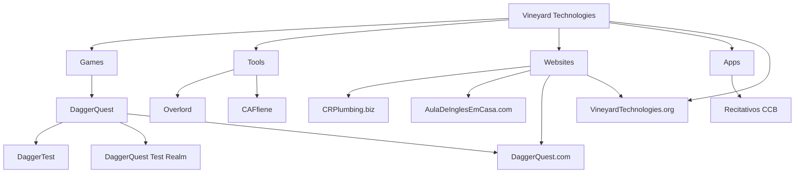

## 📖 About Us

Vineyard Technologies is a software development company based in Seattle, WA. We partner with businesses to deliver exceptional software solutions and help scale development teams with trusted professionals who understand your business needs. We build our foundation on integrity and expertise, creating reliable software that truly serves our clients.

## 🌟 What We Do

- **Custom Software Development** - Creating tailored software solutions that meet your specific business requirements
- **Team Augmentation** - Providing expert developers to scale your existing development teams
- **Full-Stack Solutions** - Delivering end-to-end software development from concept to deployment
- **Professional Partnership** - Working as trusted partners who understand your business and technical challenges

##  🌳Repository Organization

## 📫 Our Website

### [VineyardTechnologies.org](https://VineyardTechnologies.org)

## 📄 Licenses

Most of our projects are released under various open source licenses. Check individual repositories for specific licensing information.
