#  Vineyard Technologies

### _**His leaf also shall not whither, and whatsoever he doeth shall prosper**_

*The official GitHub organization for Vineyard Technologies*

---

## 📖 About Us

Vineyard Technologies is a mobile app development company committed to creating innovative, high-quality mobile solutions. We build our foundation on integrity and honesty, delivering reliable applications that truly serve our clients and their users.

## 🌟 What We Do

- **Mobile App Development** - Crafting intuitive and powerful mobile applications for iOS and Android platforms
- **Client-Focused Solutions** - Developing custom mobile solutions tailored to meet specific business needs
- **Ethical Technology** - Building applications with integrity, prioritizing user privacy and transparent business practices

## ⚒️ Current Projects

  

## 📖 Repository Architecture

```mermaid
graph TD
    A[🌿 Vineyard Technologies] --> B[Recitativos CCB]
    A --> C[Unnamed Tuner App]
    A --> D[VineyardTechnologies.org]
```

## 📫 Our Website

### [VineyardTechnologies.com](https://VineyardTechnologies.com)

## 📄 Licenses

Unless otherwise specified, our projects are released under various open source licenses. Check individual repositories for specific licensing information.
